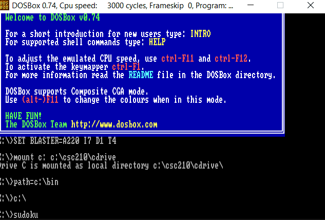

# Sudoku 12x12 in Assembly
Project for CSC 210: Assembly Language Programming (Fall 2019)

Language: x86 TASM Assembly Language

## Description
I have created a 12 by 12 Sudoku through x86 Assembly. It contains only one board, however it has the option to press the "spacebar" key to move the pointer to the next available spot. 
Press 1 to 9 to fill the current spot with its respective number, or A to C for 10 to 12.  
After the pointer has reached to the last slot, the user has an option to press the "enter" key to reveal the solution or to press the "spacebar" key to move the pointer back to the first slot.
## Instructions 
### DOSBox is needed with TASM installed to run this program!
There are plenty of tutorials out there to install DOSBox with TASM. (A bit of a hassle, I know :tired_face: )

After having them installed, make sure that DOSBox is mounted to the folder with sudoku.asm in it 

In DOSBox, run the following commands to compile and run it:

1) tasm sudoku.asm
2) tlink sudoku.obj /t
3) sudoku

## Quick Demo

